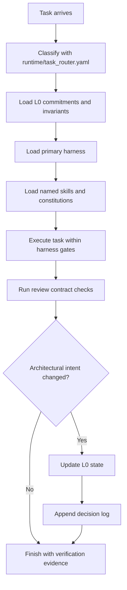
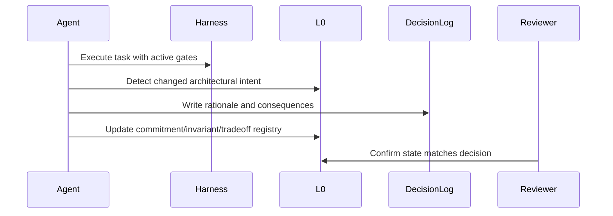
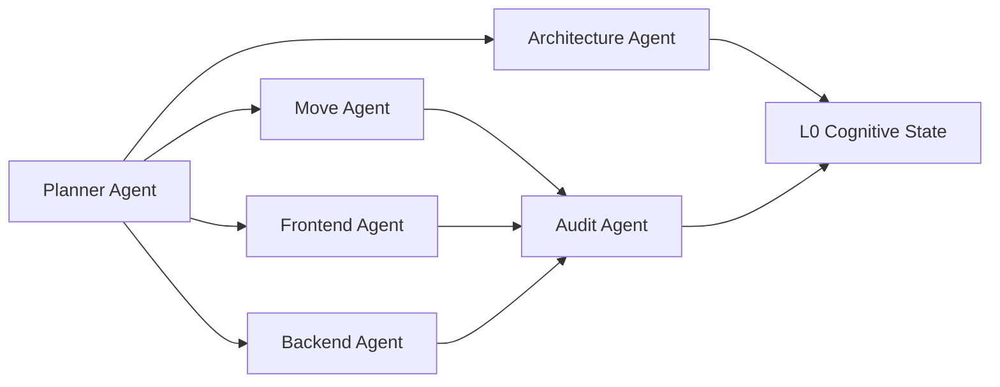

# Sui Stack Operational Cognition Framework RFC

Status: accepted
Date: 2026-05-20
Owner: architecture

## Purpose

Sui Stack Skills is a skills-first repository with hidden operational cognition for coding agents.

The goal is not more visible structure. The goal is skills-powered architectural coherence with minimal cognitive overhead.

## Skills-First Principle

The primary abstraction is `skills/`.

The cognition runtime is supporting infrastructure. Users should activate skills such as `move_core`, `ptb_runtime`, or `wallet_ux`; those skills then activate cognition, invariants, harnesses, constitutions, runtime profiles, and review contracts.

```yaml
active_skills:
  - move_core
  - ptb_runtime
  - wallet_ux
```

Agents should not ask users to manually orchestrate L0/L1/L2/L3 layers.

## Repository Tree

```text
sui-stack-skills/
  SKILL.md
  AGENTS.md
  package.json
  LICENSE
  skills/
    README.md
    manifest.yaml
    activation.schema.yaml
    move_core/SKILL.md
    ptb_runtime/SKILL.md
    wallet_ux/SKILL.md
    security_audit/SKILL.md
    sui_architecture/SKILL.md
    cognition_stability/SKILL.md
    architecture/
    domain/
    implementation/
    review/
  cognition/
    README.md
    schemas/
      cognitive_state_schema.md
    state/
      architectural_commitments.yaml
      compressed_context.yaml
      conflict_registry.yaml
      cognitive_checksums.yaml
      drift_metrics.yaml
      forbidden_reversions.yaml
      invariants.yaml
      lifecycle_policy.yaml
      rejected_patterns.yaml
      reasoning_snapshots.yaml
      resilience_policy.yaml
      unresolved_tradeoffs.yaml
      decision_log/
        2026-05-20-operational-cognition-framework.md
        2026-05-20-cognition-stability-semantics.md
        2026-05-20-compressed-cognition-runtime.md
        2026-05-20-cognition-resilience-policy.md
  harnesses/
    README.md
    financial-safety.yaml
    frontend-transaction.yaml
    move.yaml
    ptb.yaml
  constitutions/
    README.md
    anti-drift.yaml
    core.yaml
    sui-safety.yaml
  runtime/
    README.md
    flash_context_profile.yaml
    repository-architecture-harness.yaml
    task_router.yaml
  review/
    README.md
    audit_checklist.md
    review_contracts.yaml
  agent_roles/
    README.md
    roles.yaml
  docs/
    skills-first-architecture.md
    migration-map.md
    operational-cognition-rfc.md
```

## Layer Model

| Layer | Directory | Responsibility |
| --- | --- | --- |
| Skill Interface | `skills/*/SKILL.md` | Primary activation surface |
| Skill Manifest | `skills/manifest.yaml` | Agent discovery and composition metadata |
| Hidden Cognitive State | `cognition/state/` | Persistent intent, invariants, compression, checksums, metrics |
| Hidden Runtime | `runtime/` | Routing and model profiles activated by skills |
| Hidden Harnesses | `harnesses/` | Task-local execution gates activated by skills |
| Hidden Constitutions | `constitutions/` | Behavioral constraints activated by skills |
| Hidden Review | `review/` | Completion contracts activated by skills |
| Hidden Agent Roles | `agent_roles/` | Internal authority boundaries |

## Ownership Boundaries

| Area | Owner | Change rule |
| --- | --- | --- |
| `cognition/state/` | architecture | Decision log required for commitment, invariant, rejected pattern, or forbidden reversion changes |
| `skills/domain/sui/` | move | Move and Sui domain review required |
| `skills/domain/infrastructure/` | frontend or backend | Review depends on wallet, PTB, storage, identity, or service impact |
| `skills/implementation/` | domain implementer | Harness required only when transaction, safety, or architecture boundaries change |
| `harnesses/` | architecture plus domain owner | Must stay small and executable by reading |
| `constitutions/` | architecture | Must constrain reasoning, not duplicate skill knowledge |
| `review/` | audit | Must define completion blockers clearly |
| `agent_roles/` | architecture | Must remain lightweight and operational |

## Runtime Interaction Model



## L0 Cognitive State Design

L0 is persistent architectural cognition. It is not scratch notes or a project diary.

It records:

- architectural commitments
- active invariants
- rejected patterns
- unresolved tradeoffs
- forbidden reversions
- cognitive checksums
- compressed contexts
- conflict records
- reasoning snapshots
- cognition weights
- drift metrics
- cognitive budgets
- promotion and demotion policy
- boundary isolation rules
- drift recovery flows
- human cognition anchors
- freshness and supersession semantics
- rationale and decision history

### Example Commitment

```yaml
- id: minimum-viable-cognition
  status: active
  owner: architecture
  commitment: "The framework remains a lightweight cognition system, not an autonomous orchestration platform."
  rationale: "The success metric is reduced architectural drift across long coding sessions, not more structure."
```

### Example Invariant

```yaml
- id: ptb-atomicity-visible
  status: active
  owner: frontend
  invariant: "Transaction flows that depend on multiple Sui operations must document the PTB atomicity boundary."
  failure_mode: "Frontend or backend agents split atomic logic into inconsistent multi-step flows."
```

### Example Rejected Pattern

```yaml
- id: giant-policy-runtime
  pattern: "A large autonomous policy engine that interprets many fragmented rules before every task."
  rejected_because: "It increases token overhead and maintenance burden without proving drift reduction."
  acceptable_alternative: "Small YAML harnesses plus human-readable constitutions loaded by task type."
```

### Update Flow



## Cognitive Checksums

Cognitive checksums are session-level coherence summaries. They help answer: has the agent silently drifted architecturally?

They are not cryptographic hashes and do not require tooling.

```yaml
cognitive_checksum:
  active_commitments:
    - minimum-viable-cognition
    - l0-before-retrieval
  active_invariants:
    - ptb-atomicity-visible
  touched_invariants:
    - ptb-atomicity-visible
  freshness_flags:
    - id: sdk-versioning
      freshness: refresh_required
      action: "Refresh before implementation."
  supersession_flags:
    - "No active contradiction detected."
  potential_conflicts:
    - "None."
  drift_assessment: low
```

Runtime use:

- create or select a checksum before substantial work
- update touched invariants during the task
- record freshness and supersession flags
- validate drift is `none` or `low` before review

If drift is `medium` or `high`, stop and resolve the conflict before completion.

## Context Compression

Compressed contexts are deterministic working cognition sets. They prevent L0 inflation from turning every task into full historical reload.

```yaml
compressed_context:
  foundational_truths:
    - id: sui-object-first-design
      meaning: "Sui design starts from objects, capabilities, and PTB atomicity."
  active_architecture:
    - id: skills-are-knowledge-not-policy
      meaning: "Skills teach; L0 and harnesses constrain."
  active_risks:
    - id: shared-object-contention
      meaning: "Shared objects can serialize throughput and need rationale."
  forbidden_regressions:
    - id: giant-policy-runtime
      meaning: "Do not introduce a large autonomous rule engine."
  expansion_refs:
    - cognition/state/invariants.yaml
```

Compression rules:

- preserve architectural intent, foundational invariants, critical rationale pointers, and forbidden regressions
- compress by stable IDs and one-line meanings
- expand source references only when the task touches the relevant domain
- never omit critical cognition from a task that can affect it
- if a compressed set hides a task-critical item, update compression-effectiveness drift metrics

This is not a summarization engine. The compressed context is explicit YAML.

## Cognition Conflict Detection

Conflict detection records cognitive tension without becoming a theorem prover.

```yaml
- id: object-ownership-vs-shared-object-throughput
  status: active
  type: soft_tension
  severity: medium
  commitment_a: sui-object-first-design
  commitment_b: shared-object-parallelism
  resolution_required: true
```

Conflict types:

- `hard_contradiction`: active items cannot both govern the same task
- `soft_tension`: coexistence is possible with explicit tradeoff handling
- `semantic_ambiguity`: wording can be interpreted in incompatible ways
- `drift_signal`: implementation weakens or reinterprets active cognition

Severity:

- `low`: record in checksum
- `medium`: resolve or document tradeoff before completion
- `high`: architecture review
- `critical`: architecture and audit review

Runtime detection:

- compare route-loaded commitments and invariants
- check whether implementation weakens foundational or critical cognition
- check rejected pattern reintroduction
- check compressed context omissions
- record recurring unresolved tensions in `conflict_registry.yaml`

## Reasoning Snapshots

Reasoning snapshots preserve the shape of an architectural tradeoff, not verbose reasoning transcripts.

```yaml
reasoning_snapshot:
  problem: "shared treasury scalability"
  considered_options:
    - shared_objects
    - party_objects
  dominant_constraints:
    - PTB contention
    - UX simplicity
  rejected_alternatives:
    - global shared treasury object
  selected_tradeoff: "optimize for single-user latency"
  trust_assumptions:
    - "No backend custody."
  protocol_assumptions:
    - "PTB boundary remains explicit."
```

Create snapshots when a real architecture tradeoff needs to survive future sessions. Do not create snapshots for cosmetic cleanup, local naming, or full reasoning transcripts.

## Cognition Weighting

The runtime does not treat all cognition equally.

| Weight | Runtime behavior | Compression behavior |
| --- | --- | --- |
| `critical` | inject for relevant routes; refresh before use if stale | never omit when route is relevant |
| `high` | inject when it shapes architecture or authority | preserve in route compressed context |
| `medium` | inject only when harness or task references it | include only when directly relevant |
| `low` | advisory; do not block safety work | omit by default |

Weighting interacts with freshness:

- stale critical cognition must be refreshed before implementation
- high-weight cognition refreshes when touched or when its owning layer changes
- medium cognition can remain checksum-only unless repeated across sessions
- low cognition should not become L0 unless it affects operational usability

## Drift Metrics

Drift metrics provide operational visibility, not academic benchmarking.

Tracked metrics include:

- invariant retention rate
- contradiction frequency
- rejected-pattern reintroduction
- semantic reinterpretation frequency
- unsafe refactor frequency
- architectural consistency score
- cognition entropy growth
- compression effectiveness

```yaml
- id: architectural-consistency-score
  category: retention
  measurement: "100 minus weighted penalties for unresolved conflicts, weakened invariants, stale cognition reliance, and rejected-pattern reintroduction."
  update_frequency: per_session
  target: ">= 90 before completion."
```

Metrics update only when a real drift signal affects implementation. They are review prompts, not performance theater.

## Cognitive Budgeting

Cognitive budgets bound the active runtime surface.

```yaml
cognition_budget:
  max_active_commitments: 7
  max_runtime_invariants: 12
  max_reasoning_snapshots: 3
  max_conflict_contexts: 2
  compression_priority:
    - foundational_truths
    - active_architecture
    - active_risks
```

Budget rules:

- keep critical cognition before high, high before medium, medium before low
- keep foundational invariants before operational or cosmetic invariants
- replace verbose rationale with decision-log references
- remove low-weight and cosmetic cognition from runtime injection before dropping anything else
- split the task or escalate if required cognition still exceeds budget

For Gemini Flash, the budget is stricter: fewer commitments, fewer invariants, one snapshot, one conflict context, and at most two expanded source files.

## Cognitive Promotion And Demotion

Cognition mobility prevents both stale memory and premature constitutionalization.

Promotion path:

```text
temporary insight -> validated pattern -> architectural commitment -> foundational invariant
```

Demotion path:

```text
stale architecture -> deprecated -> archived -> pruned
```

Promotion criteria:

- repeated operational evidence or safety-critical review
- clear value beyond a local implementation
- architecture approval for commitments
- architecture and audit approval for foundational invariants

Demotion criteria:

- no active route, harness, constitution, review contract, or compressed context depends on it
- replacement or rationale lineage remains available
- human anchors are not affected, or human override is present

## Cognition Boundary Isolation

Boundary isolation limits agent context to what the role needs.

```yaml
cognition_visibility:
  frontend-agent:
    visible:
      - sui-transaction-compressed
      - transaction UX cognition
      - wallet approval and finality invariants
    hidden_by_default:
      - Move storage layout internals unless transaction semantics depend on them
```

Rules:

- inject role-scoped cognition by default
- share IDs and one-line meanings before whole files
- expand hidden cognition only for cross-boundary safety, trust, authority, or PTB decisions
- architecture mediates cross-boundary conflicts
- audit can request any safety-relevant cognition

Isolation should reduce context pollution without creating rigid silos.

## Drift Recovery

Recovery gives agents deterministic behavior after drift detection.

Recovery events:

- checksum mismatch
- invariant instability
- conflict escalation
- semantic reinterpretation
- rejected-pattern reintroduction
- human-anchor violation

Severity flow:

- `low`: refresh checksum and compressed context
- `medium`: reload foundational cognition, refresh compressed context, resolve conflict before completion
- `high`: stop implementation, reload L0 source files, invalidate stale snapshots, request architecture review
- `critical`: stop implementation, rollback unstable cognition, reload human anchors and foundational invariants, request human and audit review

Recovery is not fault-tolerance infrastructure. It is a small deterministic response table.

## Human Cognition Anchors

Human anchors protect architectural authority.

```yaml
human_anchor:
  authority: bernie_web3
  protected_commitments:
    - minimum-viable-cognition
    - sui-object-first-design
  protected_invariants:
    - ptb-atomicity-visible
  immutable_without_human_override: true
```

Rules:

- humans own foundational architecture
- agents may propose changes and flag drift
- agents must not weaken, prune, or supersede protected cognition without human override
- audit review is required when protected security, trust, fund-safety, or PTB invariants change
- human anchors are not for cosmetic conventions or ordinary implementation preferences

## Supersession Semantics

L0 status values are:

- `active`: currently governing cognition
- `experimental`: trial cognition that cannot override active state
- `deprecated`: historically valid but discouraged for new work
- `superseded`: replaced by another item
- `rejected`: intentionally avoided pattern

Superseded cognition must include `superseded_by`. Successor cognition should include `supersedes` when replacement is direct.

State transition rule:

```text
experimental -> active | deprecated | rejected
active -> superseded | deprecated
deprecated -> superseded | rejected
superseded -> active only through a new decision log entry
rejected -> active only through a new decision log entry
```

Conflict handling:

- active beats experimental
- active beats superseded
- rejected blocks implementation when relevant
- conflicting active items require a decision log before continuing

## Decision Crystallization

Crystallization is controlled persistence. It prevents cognitive garbage accumulation.

Crystallize:

- architecture decisions
- invariant changes
- ownership model changes
- trust boundary changes
- protocol assumptions
- security assumptions
- PTB semantics
- authority boundaries

Do not crystallize:

- naming tweaks
- cosmetic refactors
- local cleanup
- formatting changes
- minor implementation details

Persistence thresholds:

- `decision_log_required`: semantic L0, trust, authority, or invariant change
- `checksum_only`: session coherence note with no lasting architecture change
- `do_not_persist`: local code/docs concern only

Rollback:

- L0 rollback restores prior status and adds decision rationale
- checksum-only rollback updates the checksum
- accidental unused entries may be corrected, but rationale lineage should not be deleted casually

## Cognitive Freshness

Not all cognition has the same lifetime.

| Freshness | Meaning | Refresh policy |
| --- | --- | --- |
| `foundational` | Core safety or framework principle | Review quarterly or when contradicted by architecture |
| `stable` | Valid across normal refactors | Refresh when owning layer changes |
| `refresh_required` | External or fast-moving assumption | Refresh before relying on it |
| `volatile` | Short-lived operational context | Refresh every session or before use |

Freshness keeps old cognition from becoming false authority. SDK, wallet API, RPC, deployment, and incident state should not be treated like foundational Move capability semantics.

## Tiered Invariants

The invariant system is tiered so trivial conventions do not block important work.

| Tier | Enforcement | Consequence |
| --- | --- | --- |
| `foundational` | blocker | stop work; architecture and audit review |
| `architectural` | strong | resolve before completion; architecture review |
| `operational` | normal | fix or document harness exception |
| `cosmetic` | advisory | do not block safety work |

Examples:

- foundational: capability enforcement, non-custodial guarantees, PTB atomicity
- architectural: ownership model, authority boundaries, event consistency
- operational: folder structure, review flow, logging conventions
- cosmetic: naming, formatting, documentation style

## Skills Refactor

The old folders remain as knowledge, but now under `skills/`:

- Sui Move and CLI are domain skills.
- dApp Kit, Walrus, Seal, zkLogin, DeepBook, and Enoki are infrastructure skills.
- React, Vue, Next.js, Astro, Tailwind, Bootstrap, and Framer Motion are frontend implementation skills.
- Clean code, security, performance, and testing are engineering implementation skills.
- Product preparation and system design are architecture skills.
- Advanced security, optimization, and incident response are review skills.

This preserves usability while preventing skill prose from becoming hidden policy.

## Minimum Runtime

The runtime is a protocol, not an engine.

### Before Task

- Route the task.
- Select compressed context.
- Select role visibility scope and cognition budget.
- Load L0.
- Check lifecycle status, freshness, supersession, resilience policy, and human anchors.
- Load or create the checksum.
- Check conflict registry and metric focus.
- Load one primary harness.
- Load only harness-named skills.
- Load core constitution plus domain constitution.

### During Task

- Name active invariants at risk.
- Track touched invariant tiers.
- Track cognition weights.
- Keep active cognition within budget.
- Preserve commitments.
- Avoid rejected patterns.
- Refresh stale cognition before relying on it.
- Record conflicts that affect implementation.
- Apply promotion and demotion rules before changing L0 status.
- Run recovery for medium-or-higher drift events.
- Create reasoning snapshots only for real tradeoff topology.
- Update checksum conflicts and drift assessment.
- Escalate when authority boundaries are crossed.
- Refresh L0 before large edits after long context accumulation.

### After Task

- Run verification.
- Apply review contracts.
- Validate checksum drift is `none` or `low`.
- Validate compression preserved critical and high-weight cognition.
- Validate no unresolved medium-or-higher conflict remains.
- Validate budget, boundary isolation, and human anchors.
- Validate recovery completed for any medium-or-higher drift event.
- Update drift metrics only for real drift signals.
- Decide what should crystallize.
- Update L0 only when architectural intent changed.
- Add decision log rationale for any L0 change.

## Lightweight Harness Engineering

Harnesses enforce discipline without a rule engine.

The current MVP harnesses are:

- `harnesses/move.yaml`
- `harnesses/ptb.yaml`
- `harnesses/frontend-transaction.yaml`
- `harnesses/financial-safety.yaml`

Each harness defines:

- applicability
- L0 state to load
- skills to load
- constitutions to load
- before/during/after execution gates
- forbidden patterns
- review requirements

## Constitutional Modules

Constitutions constrain reasoning behavior.

They distinguish:

- knowledge: "Use dApp Kit hooks."
- behavioral constraint: "Do not fake transaction finality."
- cognitive constraint: "Load L0 before broad retrieval."

The MVP constitutions are:

- `core.yaml`: general agent conduct
- `sui-safety.yaml`: Sui object, capability, PTB, and financial reasoning
- `anti-drift.yaml`: long-session refresh discipline

## Multi-Agent Model

The multi-agent model is authority-based, not scheduler-based.



Rules:

- Domain agents own domain files.
- Audit agent can block safety-sensitive completion.
- Architecture agent owns L0 state changes.
- Planner agent coordinates harness selection and escalation.
- Cross-domain L0 changes require synchronization.

## Gemini 3.5 Flash Optimization

Gemini Flash benefits from smaller, more explicit context packets.

### Injection Strategy

For Flash, inject in this order:

1. One-paragraph task objective.
2. Compressed context.
3. Cognition budget and human-anchor flags.
4. Active checksum.
5. Relevant L0 commitment IDs and invariant IDs with tiers and weights.
6. Freshness, conflict, recovery, and supersession flags.
7. Drift metric focus.
8. One primary harness.
9. One constitution, usually `core.yaml` or `sui-safety.yaml`.
10. Only the directly relevant skill excerpts.

Avoid sending the full RFC unless the task is architecture work.

### Refresh Logic

Refresh L0:

- before large edits
- after major task pivots
- after long generated outputs
- before accepting a refactor
- before final review

### Flash-Specific Constraints

- Use IDs, not long prose, to keep commitments visible.
- Prefer compressed contexts over RFC prose.
- Enforce the Gemini Flash budget before expanding context.
- Inject only route-visible cognition unless a boundary crossing requires more.
- Always include relevant human anchors.
- Restate active invariants before editing.
- Restate invariant tiers before changing safety or architecture boundaries.
- Restate critical and high-weight cognition before editing.
- Regenerate checksum after task pivots or long outputs.
- Escalate medium conflicts before final response.
- Trigger recovery on checksum mismatch, rejected-pattern reintroduction, or anchor touch.
- Prefer one harness over multiple.
- Put forbidden patterns in direct bullet form.
- Ask for explicit rationale before reversing a prior decision.
- Avoid asking Flash to infer policy from long skill files.

## MVP Roadmap

### Phase 1: L0 First

Build and maintain:

- architectural commitments
- invariants
- lifecycle policy
- resilience policy
- compressed contexts
- conflict registry
- reasoning snapshots
- drift metrics
- cognitive checksums
- rejected patterns
- forbidden reversions
- unresolved tradeoffs
- decision logs

Validation:

- agents can explain current architecture constraints in under five minutes
- refactors preserve active commitments
- decision reversals include rationale
- checksum drift is identified before final review
- critical cognition survives compressed injection
- unresolved medium-or-higher conflicts are visible before completion
- cognition budget prevents unbounded runtime context
- human anchors protect foundational architectural authority

### Phase 2: Drift Reduction

Build:

- task router
- Move/PTB/frontend/financial harnesses
- core and Sui constitutions

Validation:

- fewer repeated violations of Sui object and PTB assumptions
- transaction tasks document atomicity boundaries
- financial tasks name safety assumptions before optimization

### Phase 3: Runtime Integration

Build:

- checklist-driven before/during/after workflow
- review contracts
- simple text validation for required YAML fields and broken links
- checksum validation during review
- freshness and supersession checks in task routing
- compressed-context validation
- conflict checks and drift metric reporting
- budget, isolation, recovery, and human-anchor checks

Do not build:

- daemon runtime
- custom DSL
- policy interpreter
- graph cognition system
- cryptographic checksums
- automated memory pruning
- generated summarization engine
- theorem-prover conflict detector
- automated governance workflow
- dynamic memory scheduler
- permission bureaucracy for cosmetic changes
- automatic human-override simulation

### Phase 4: Multi-Agent Reliability

Build:

- role ownership discipline
- L0 synchronization protocol
- review escalation patterns

Validation:

- domain agents do not overwrite each other's architectural assumptions
- architecture changes are serialized through decision logs

## Metrics

Useful metrics:

- number of active invariants preserved during refactors
- number of decision reversals with rationale
- number of harness-required review checks completed
- number of repeated drift failures by category
- number of tasks that required L0 refresh
- number of checksum conflicts resolved before completion
- number of stale cognition refreshes before implementation
- compression effectiveness for critical and high-weight cognition
- architectural consistency score
- unresolved conflict count by severity
- cognition entropy growth per session
- budget overflow count
- recovery events by severity
- human-anchor touch count
- time to identify governing architectural intent

Weak metrics:

- number of YAML files
- number of skills
- number of agent roles
- size of the RFC

## Reality Check

This framework genuinely matters when:

- sessions are long
- multiple agents touch related architecture
- Sui object or PTB semantics are easy to forget
- financial or authorization invariants matter
- prior decisions must survive refactors
- context windows are saturated by long-horizon work
- compressed cognition must still preserve architecture
- agent roles need isolation to avoid context pollution
- protected human architecture intent must not be overwritten by agents

Normal skills or RAG are enough when:

- the task is a small implementation lookup
- no persistent architecture is at risk
- a single file change does not affect invariants
- the agent only needs API usage examples

This solves:

- architectural amnesia
- hidden rationale loss
- repeated unsafe pattern reintroduction
- task-local drift from global intent
- weak review discipline

This does not solve:

- bad source material
- missing tests
- unreviewed economic design
- model hallucination by itself
- poor human ownership
- every multi-agent coordination problem
- semantic understanding without human review
- accurate drift metrics if agents record cosmetic noise
- automatic recovery from bad architecture decisions
- perfect isolation when tasks genuinely cross boundaries

## Critical Risks

| Risk | Reality | Mitigation |
| --- | --- | --- |
| Maintenance burden | L0 can become stale if nobody updates it | Keep registries small and decision-backed |
| Token overhead | Loading too much context hurts fast models | Load IDs, one harness, and narrow skills |
| Checksum overhead | Agents may update checksums mechanically | Keep checksums short and task-scoped |
| Compression loss | Small context packets can omit important constraints | Critical and high-weight cognition must survive compression |
| Conflict bureaucracy | Too many conflicts can slow work | Record only conflicts that affect implementation |
| Metric theater | Metrics can become fake precision | Use metrics as review prompts, not performance theater |
| Budget loss | Strict budgets can omit needed context | Critical cognition and human anchors are non-droppable |
| Isolation fragmentation | Role-scoped cognition can hide useful context | Escalate and share IDs when boundaries are crossed |
| Recovery instability | Recovery rules can become a second runtime | Keep recovery as a manual severity table |
| Governance creep | Human anchors can become approval bureaucracy | Anchor only foundational architecture, trust, safety, and PTB semantics |
| Rigidity | Old decisions can block better designs | Require rationale, not permanence |
| Overformalization | More folders can become fake rigor | Add structure only when it reduces drift |
| Usability | Agents may ignore the system if it is heavy | Keep runtime manual and readable |
| Scaling | Multi-agent sync can become bureaucratic | Escalate only active L0 and safety boundaries |

## Acceptance Criteria

The MVP is acceptable when:

- a new agent can load L0 and know what must not drift
- a task can select one harness without custom tooling
- existing Sui knowledge remains easy to find
- architectural reversals require decision rationale
- review contracts identify blockers before completion claims
- compressed contexts preserve critical cognition with lower token overhead
- conflicts and drift signals are visible without a policy engine
- cognition budgets bound runtime context
- human anchors protect foundational intent without governing cosmetic work
- the repository remains readable as Markdown and YAML
