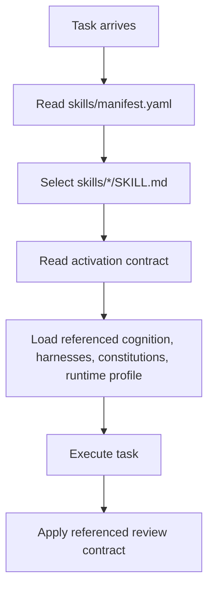

# Skills-First Architecture

The primary abstraction is `skills/`.

The cognition runtime exists to support skill activation. It should not be the user-facing UX.

## Repository Tree

```text
sui-stack-skills/
  SKILL.md
  AGENTS.md
  package.json
  skills/
    manifest.yaml
    activation.schema.yaml
    move_core/SKILL.md
    ptb_runtime/SKILL.md
    wallet_ux/SKILL.md
    security_audit/SKILL.md
    sui_architecture/SKILL.md
    cognition_stability/SKILL.md
    domain/
    implementation/
    architecture/
    review/
  cognition/
  harnesses/
  constitutions/
  runtime/
  review/
  agent_roles/
```

## External UX

Users should think in skills:

```yaml
active_skills:
  - move_core
  - ptb_runtime
  - wallet_ux
```

Installers can treat this repository as a filesystem-native skill pack:

```bash
npx skills add bernieweb3/sui-stack-skills
```

## Activation Flow



## Hidden Substrate

The following folders are internal by default:

- `cognition/`
- `harnesses/`
- `constitutions/`
- `runtime/`
- `review/`
- `agent_roles/`

They remain readable and filesystem-native, but agents should not expose them as the primary UX.

## Skill Contract Semantics

Each first-class skill defines:

- activated cognition
- activated invariants
- activated harnesses
- activated constitutions
- review contracts
- runtime profile
- budget and visibility scope
- composition notes

This keeps operational cognition available without asking users to manually load layers.

## What Stays Internal

- lifecycle policies
- resilience policies
- cognitive checksums
- drift metrics
- reasoning snapshots
- harness execution gates
- constitutions
- review contracts

Expose these only when a task changes the framework or when a review finding needs the source of authority.

## What Should Not Be Built

- executable orchestration daemon
- dependency resolver for skills
- symbolic cognition graph
- policy runtime
- generated prompt compiler
- installer-specific lock-in

Filesystem semantics are enough for the MVP.
